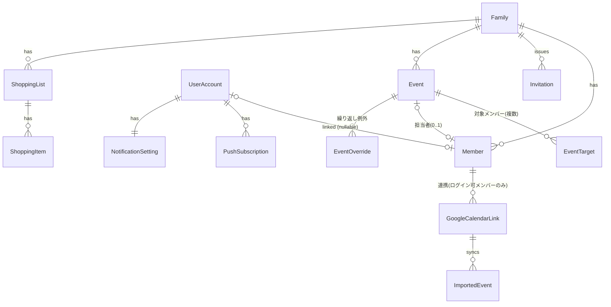

# iegoto ドメインモデル・データモデル設計書

作成日: 2026-07-17（同日更新: R-2完了により§5の未決事項を解消）
ステータス: 決定案
関連: `docs/design/01-spec-decisions.md` / `docs/design/02-tech-selection.md` / `docs/design/07-backend-design.md`

---

## 1. 集約の全体像

集約ルート（DDD）: `Family`（メンバー・招待を含む）/ `Event` / `ShoppingList` / `GoogleCalendarLink` / `UserAccount`

- テナント境界は常に `familyId`。**全クエリ・全リポジトリメソッドが familyId を必須引数に取る**ことで、家族外アクセス不可（§6 セキュリティ要件）を構造的に保証する
- `ImportedEvent` は `Event` と別テーブル。読み取り専用（F-07）でライフサイクルが同期に支配されるため、編集可能な `Event` と混ぜない。カレンダー表示時に2ソースをマージする

## 2. テーブル定義（主要カラムのみ）

### family
| カラム | 型 | 備考 |
|---|---|---|
| id | uuid PK | |
| name | text | 「◯◯家」 |
| created_at / updated_at | timestamptz | |

### user_account
| カラム | 型 | 備考 |
|---|---|---|
| id | uuid PK | |
| google_sub | text UNIQUE | Google `sub` クレーム。emailは変わりうるのでキーにしない |
| email | text | 表示用 |
| display_name / avatar_url | text | Googleプロフィール初期値 |

### member
| カラム | 型 | 備考 |
|---|---|---|
| id | uuid PK | |
| family_id | uuid FK | |
| user_account_id | uuid FK NULL | NULL=ログイン不可プロフィール（子ども）。S-1 |
| display_name | text | |
| color | text | メンバーカラー（プリセットから選択） |
| icon | text | アイコン識別子 |
| sort_order | int | 表示順 |
| deleted_at | timestamptz NULL | 論理削除。S-3 |

制約: `UNIQUE (user_account_id) WHERE user_account_id IS NOT NULL AND deleted_at IS NULL` — 1アカウント1家族（S-7）と家族内1プロフィール（S-1）を同時に強制。

### invitation
| カラム | 型 | 備考 |
|---|---|---|
| id | uuid PK | |
| family_id | uuid FK | |
| token_hash | text UNIQUE | SHA-256。平文は保存しない（S-2） |
| expires_at | timestamptz | 発行+7日 |
| revoked_at | timestamptz NULL | 手動失効 or 新規発行時の自動失効 |
| created_by_member_id | uuid FK | |

### event（繰り返しのマスタを含む）
| カラム | 型 | 備考 |
|---|---|---|
| id | uuid PK | |
| family_id | uuid FK | |
| title | text | |
| normalized_title | text | サジェスト照合用（S-5）。INDEX |
| memo / location | text NULL | |
| is_all_day | boolean | |
| start_at / end_at | timestamptz NULL | 時間指定予定用（UTC） |
| start_date / end_date | date NULL | 終日予定用（TZ非依存。S-4） |
| timezone | text | MVPは常に 'Asia/Tokyo'（S-4） |
| rrule | text NULL | iCal RRULE文字列。NULL=単発 |
| recurrence_end_at | timestamptz NULL | RRULEのUNTIL/COUNTから事前計算した実終端（期間クエリ最適化用。無期限はNULL） |
| assignee_member_id | uuid FK NULL | 担当者。NULL=担当者未定（F-04） |
| reminder_minutes_before | int NULL | NULL=リマインダーなし（S-6） |
| next_reminder_at | timestamptz NULL | 次回リマインダー発火時刻の事前計算値。INDEX。書き込み時と発火後に再計算（繰り返しはRRULEから次回を導出）。NULL=なし/消化済み |
| created_by_member_id | uuid FK | |
| deleted_at | timestamptz NULL | |

- `event_target (event_id, member_id)` : 対象メンバー（複数可、F-03）
- 担当者はMVPでは**単数**（要件F-03/F-04の表記に合わせる）。複数担当（行き送迎/帰り送迎）が必要になったら中間テーブル化する

### event_override（繰り返しの例外。F-03「この予定のみ」編集）
| カラム | 型 | 備考 |
|---|---|---|
| id | uuid PK | |
| event_id | uuid FK | 繰り返しマスタ |
| original_start_at | timestamptz | どの回の例外か（展開時のキー） |
| is_cancelled | boolean | この回のみ削除 |
| title / memo / location / start_at / end_at / assignee_member_id ... | | 上書き値（NULL=マスタ値を継承）。対象メンバー上書きは `event_override_target` |

### shopping_list / shopping_item
| shopping_item | 型 | 備考 |
|---|---|---|
| id | uuid PK | |
| shopping_list_id | uuid FK | |
| name | text | |
| added_by_member_id | uuid FK | 「誰が追加したか」（F-05） |
| checked_at | timestamptz NULL | NULL=未購入 |
| checked_by_member_id | uuid FK NULL | |
| deleted_at | timestamptz NULL | |

### google_calendar_link / imported_event（F-07）
| google_calendar_link | 型 | 備考 |
|---|---|---|
| id | uuid PK | |
| family_id | uuid FK | |
| user_account_id | uuid FK | OAuth認可した本人 |
| display_member_id | uuid FK NULL | インポート予定の紐づけ先メンバー |
| google_calendar_id | text | |
| refresh_token_encrypted | bytea | AES-256-GCM。鍵はSecret Manager（T-7） |
| sync_token | text NULL | 差分同期用 |
| last_synced_at | timestamptz NULL | |

`imported_event` はGoogle側イベントのスナップショット（google_event_id UNIQUE within link、title、開始終了、繰り返しは**展開済み個別イベントとして保存**する — Google API の `singleEvents=true` で取得し、自前RRULE展開を持ち込まない）。

### push_subscription / notification_setting（F-08 / S-6）
- `push_subscription (id, user_account_id, endpoint UNIQUE, p256dh, auth, created_at)` — 端末ごとに複数
- `notification_setting (user_account_id PK, event_change_enabled bool default true, reminder_enabled bool default true)`

## 3. 繰り返し予定の設計（F-03の核心）

方式: **マスタ+RRULE+例外テーブル、表示時展開**（Googleカレンダーと同方式）。展開結果はDBに保存しない。

- **表示**: 期間クエリ（例: 月表示の6週間）に対し、(a)単発予定を期間で検索、(b)繰り返しマスタを `start_at <= 期間末 AND (recurrence_end_at IS NULL OR recurrence_end_at >= 期間先頭)` で絞り、サーバ側で `rrule` ライブラリにより**イベントのtimezoneローカルで**展開 → `event_override` を突き合わせ（削除回を除去・上書き回を差し替え）→ 単発とマージして返す
- **「この予定のみ」編集** → `event_override` をUPSERT
- **「これ以降すべて」編集** → マスタを分割: 旧マスタのRRULEに `UNTIL=対象回の直前` を設定し、対象回以降を新マスタとして作成（例外のうち新期間に属するものは新マスタへ付け替え）
- **「すべて」編集** → マスタを直接更新（例外は保持）
- 無限繰り返しの展開上限: 表示要求期間内のみ展開するため問題にならないが、安全弁として1マスタあたり最大1000回/クエリで打ち切る

## 4. 主要ユースケース（application層の粒度の当たり）

認証系: `signUpFamily` / `signInWithGoogle` / `issueInvitation` / `revokeInvitation` / `joinFamilyByInvitation`（S-1の既存プロフィール紐づけ含む）
メンバー系: `addMember` / `updateMember` / `unlinkMemberAccount`（退出） / `softDeleteMember`（S-3の担当者未定化を含むトランザクション）
予定系: `createEvent` / `updateEvent`（3択の編集スコープ引数） / `deleteEvent`（同） / `listEventsInRange`（展開・マージ） / `listMyAssignedEvents` / `listUnassignedEvents` / `suggestPastEvents`（S-5）
買い物系: `createShoppingList` / `addItem` / `checkItem` / `uncheckItem` / `deleteItem`
連携系: `linkGoogleCalendar` / `unlinkGoogleCalendar`（revoke含む） / `syncGoogleCalendar`（Scheduler起点）
通知系: `subscribePush` / `updateNotificationSetting` / `dispatchEventChangeNotifications`（変更系ユースケースから発火） / `dispatchReminders`（分単位Scheduler起点: `next_reminder_at <= now()` の予定をINDEX一発で抽出して送信し、送信後に次回発火時刻を再計算してUPDATE。毎分全予定をRRULE展開して照合する方式は採らない — 展開はイベントの書き込み時と発火後のみに限定し、展開バグの影響面と毎分の計算量を抑える）

## 5. レイヤ構成（R-2完了により確定 → 詳細は `07-backend-design.md`）

R-2の抽出結果（`05-plainer-extraction-report.md`）を反映して以下のとおり確定した:

- **レイヤ間の依存ルール・ディレクトリ命名**: plainerの独自マッピング（`route/`にUseCase同居）は
  持ち込まず、DDD標準の層名に正規化（presentation=`modules/*/router.ts` / application=`modules/*/usecases/` /
  domain=`packages/domain` / infrastructure=`packages/db`）。依存方向はパッケージ境界で物理強制
- **リポジトリインターフェース**: plainerに合わせ**interface分離なし・具象クラスのみ**（`packages/db`）。
  ただしメソッドの引数・戻り値はdomainエンティティに限定しPrisma型を漏らさない。
  全メソッドの第一引数を`familyId`必須にして§1のテナント境界を型で強制
- **ユースケースの実装単位**: **1ユースケース = 1ファイル = 1 exported関数**（plainerの
  「1 UseCase 1クラス・public `process()`のみ」のTS翻訳）。§4の一覧と1:1対応。トランザクション境界はUseCase
